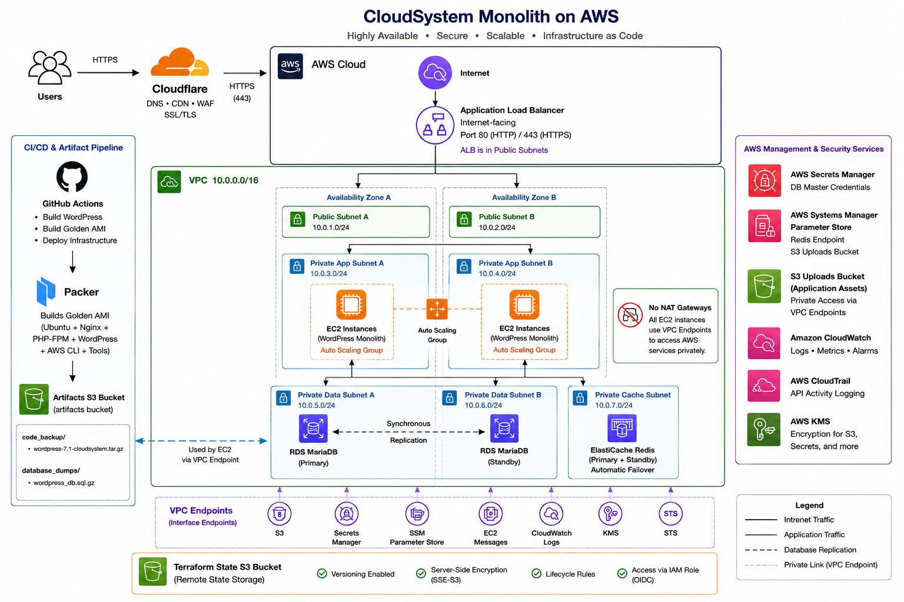

# CloudSystem Monolith

Production-style AWS infrastructure for a horizontally scalable WordPress application, built with **Terraform, Packer, GitHub Actions, Amazon RDS MariaDB, ElastiCache Redis, S3, Cloudflare DNS, and AWS Systems Manager**.

The project demonstrates an infrastructure-as-code approach to deploying a stateful WordPress workload while keeping application instances disposable and environment-specific configuration outside the Golden AMI.

---

## Architecture



### Logical architecture

```text
                              Internet
                                  |
                                  v
                         +----------------+
                         |    Cloudflare  |
                         |      DNS       |
                         +--------+-------+
                                  |
                                  v
                         +----------------+
                         |      ALB       |
                         |  HTTP / HTTPS  |
                         +--------+-------+
                                  |
                                  | :80
                                  v
                 +----------------------------------+
                 |              VPC                  |
                 |                                  |
                 |  Public Subnets                   |
                 |  +----------------------------+  |
                 |  | ALB                        |  |
                 |  +----------------------------+  |
                 |                                  |
                 |  Private Subnets                  |
                 |  +----------------------------+  |
                 |  | EC2 Auto Scaling Group      | |
                 |  | WordPress Golden AMI        | |
                 |  | Nginx + PHP-FPM             | |
                 |  +------+------------+---------+ |
                 |         |            |            |
                 |       :3306        :6379         |
                 |         |            |            |
                 |         v            v            |
                 |   +-----------+ +-----------+    |
                 |   | RDS       | | ElastiCache|   |
                 |   | MariaDB   | | Redis      |   |
                 |   +-----------+ +-----------+    |
                 |                                  |
                 |  VPC Endpoints                    |
                 |  S3 / SSM / Secrets Manager       |
                 +----------------------------------+
                         |                 |
                         v                 v
                 +---------------+   +----------------+
                 | S3 Application|   | S3 Artifacts   |
                 | Uploads       |   | Private        |
                 +---------------+   +-------+--------+
                                             |
                              +--------------+--------------+
                              |                             |
                         ami artifact                 database dump
                              |                             |
                              v                             v
                           Packer                       EC2 bootstrap
                              |                             |
                              v                             v
                         Golden AMI                    RDS import
```

---

## Design Goals

- **Immutable application image:** WordPress application code is packaged into a Golden AMI.
- **Disposable EC2 instances:** instances do not contain environment-specific credentials or database state.
- **Externalized state:** uploads live in S3, database state lives in RDS, and object caching lives in Redis.
- **Secure runtime configuration:** DB credentials come from Secrets Manager; Redis and application S3 settings come from Parameter Store.
- **Private application tier:** WordPress EC2 instances run in private subnets.
- **Private data tier:** RDS MariaDB and Redis run in private subnets.
- **Automated AMI builds:** Packer builds a new Golden AMI from the latest WordPress artifact.
- **Environment separation:** development and production use separate Terraform variable files.
- **CI/CD:** GitHub Actions authenticates to AWS using OIDC.

---

# Repository Structure

```text
cloudsystem-monolith/
├── .github/
│   └── workflows/
│       ├── oidc-test.yml
│       ├── packer-build.yml
│       └── terraform-workflow.yml
│
├── bootstrap/
│   ├── oidc.tf
│   ├── outputs.tf
│   ├── providers.tf
│   ├── s3_buckets.tf
│   ├── terraform.tfvars_example
│   └── variables.tf
│
├── packer/
│   ├── wordpress.ubuntu.pkr.hcl
│   ├── README.md
│   └── scripts/
│       └── prepare-ami.sh
│
└── terraform/
    ├── main.tf
    ├── locals.tf
    ├── providers.tf
    ├── variables.tf
    ├── development.tfvars
    ├── production.tfvars
    │
    └── modules/
        ├── networking/
        ├── security/
        ├── storage/
        ├── database/
        ├── cache/
        ├── compute/
        ├── paramters/
        └── dns-and-ssl/
```

---

# AWS Components

## Networking

The networking module creates:

- VPC
- Public subnets across three Availability Zones
- Private subnets across three Availability Zones
- Internet Gateway
- Public and private route tables
- S3 Gateway VPC Endpoint
- Interface VPC Endpoints for:
  - Systems Manager
  - EC2 Messages
  - SSM Messages
  - Secrets Manager

EC2 instances are deployed into private subnets.

---

## Application Load Balancer

The ALB is deployed in the public subnets.

Traffic flow:

```text
Internet
   |
   +--> HTTP :80
   |
   +--> HTTPS :443
          |
          v
       ALB
          |
          v
     EC2 :80
```

The ALB security group allows public HTTP/HTTPS traffic and only permits HTTP traffic from the ALB security group to the EC2 security group.

---

## EC2 Auto Scaling Group

EC2 instances use the Packer-generated Golden AMI.

The ASG:

- runs in private subnets
- uses the Golden AMI
- maintains the configured desired/min/max capacity
- registers instances with the ALB target group
- performs rolling instance refreshes when the launch template changes
- uses SSM for management

### Golden AMI contains

- Ubuntu 24.04 x86_64
- Nginx
- PHP 8.3 + PHP-FPM
- Dedicated `cloudsystem` PHP-FPM pool
- WordPress application code
- Redis Object Cache plugin
- Amazon S3 / CloudFront Offload Media plugin
- AWS CLI
- `jq`
- MariaDB client
- `gzip`
- SSM Agent
- `wp-config.php.template`

### Golden AMI does not contain

- `wp-config.php`
- database credentials
- RDS endpoint
- Redis endpoint
- S3 credentials
- WordPress uploads
- database data

---

# Runtime Bootstrap

Each EC2 instance executes the Terraform-provided user-data script.

The bootstrap process is:

```text
EC2 boot
   |
   +--> Fetch DB credentials from Secrets Manager
   |
   +--> Fetch application S3 bucket from Parameter Store
   |
   +--> Fetch Redis endpoint from Parameter Store
   |
   +--> Copy wp-config.php.template
   |
   +--> Inject runtime values using sed
   |
   +--> Check whether WordPress DB is initialized
   |
   +--> If DB is empty:
   |       |
   |       +--> Acquire DB initialization lock
   |       +--> Download SQL dump from private S3
   |       +--> Import into RDS MariaDB
   |       +--> Validate wp_options/siteurl
   |
   +--> Configure permissions
   |
   +--> Restart Nginx + PHP-FPM
   |
   v
WordPress ready
```

The database dump is **not stored in Git** and is **not included in the Golden AMI**.

---

# Database

Amazon RDS MariaDB is used as the WordPress database.

Configuration is controlled through:

```hcl
db_instance_config = {
  allocated_storage = 20
  family            = "mariadb10.11"
  engine_version    = "10.11"
  instance_class    = "db.t3.micro"
  db_name           = "wordpress"
  username          = "wordpress"
  multi_az          = false
}
```

Credentials are generated by Terraform and stored as structured JSON in Secrets Manager.

Example secret structure:

```json
{
  "host": "database-endpoint",
  "port": 3306,
  "database": "wordpress",
  "username": "wordpress",
  "password": "..."
}
```

The EC2 IAM role can retrieve the secret at runtime.

---

# Redis

Amazon ElastiCache for Redis provides the WordPress object cache.

The endpoint is published to Parameter Store:

```text
/<project>/<environment>/redis_endpoint
```

The WordPress Golden AMI already contains and activates the Redis Object Cache plugin.

---

# S3 Storage

The project intentionally uses three buckets.

## 1. Terraform state

Used only for Terraform remote state and locking.

```text
Terraform state bucket
└── cloudsystem-monolith/global/terraform.tfstate
```

This bucket is created by the bootstrap stack.

## 2. Application uploads

Used by WordPress for media/uploads.

The application bucket is intentionally public for the current project design.

## 3. Private artifacts bucket

Used for both build artifacts and database dumps.

Current layout:

```text
artificats-<account-id>-<region>-an/
│
├── code_backup/
│   └── wordpress-7.1-cloudsystem.tar.gz
│
└── database_dumps/
    └── wordpress_db.sql.gz
```

The artifact bucket is private and uses S3 server-side encryption and versioning.

---

# Packer Golden AMI Pipeline

The Packer workflow:

```text
Private S3
   |
   | code_backup/wordpress-*.tar.gz
   v
GitHub Actions
   |
   +--> Authenticate using GitHub OIDC
   |
   +--> Find latest WordPress artifact
   |
   +--> Download artifact
   |
   +--> Packer init
   +--> Packer validate
   +--> Packer build
   |
   v
Temporary EC2 builder
   |
   +--> Install/configure application
   +--> Validate Nginx
   +--> Validate PHP-FPM
   +--> Validate application runtime
   |
   v
Golden AMI
   |
   v
GOLDEN_AMI_ID GitHub repository variable
```

The Terraform workflow then consumes `GOLDEN_AMI_ID` and updates the EC2 launch template.

---

# GitHub Actions

## OIDC Test

`oidc-test.yml` verifies GitHub Actions can assume the AWS IAM role without storing long-lived AWS access keys.

## Packer Build

`packer-build.yml`:

1. Authenticates to AWS through OIDC.
2. Finds the newest WordPress artifact in S3.
3. Downloads the artifact.
4. Runs Packer.
5. Extracts the generated AMI ID.
6. Updates the `GOLDEN_AMI_ID` repository variable.

## Terraform Workflow

`terraform-workflow.yml`:

1. Authenticates to AWS through OIDC.
2. Initializes Terraform.
3. Validates configuration.
4. Creates a saved Terraform plan.
5. Applies the saved plan.
6. Supplies runtime variables through GitHub Actions environment variables.

---

# Bootstrap

Bootstrap is intentionally separated from the main Terraform stack.

It creates foundational resources such as:

- Terraform state bucket
- Private artifacts bucket
- GitHub OIDC provider
- GitHub Actions IAM role

Bootstrap should be applied before the main Terraform stack.

```bash
cd bootstrap

terraform init
terraform validate
terraform plan
terraform apply
```

The bootstrap state should itself be managed carefully because it establishes the resources required by the main infrastructure.

---

# Main Terraform Deployment

Select the target environment using the corresponding `.tfvars` file.

Development:

```bash
cd terraform

terraform init
terraform validate

terraform plan \
  -var-file="development.tfvars" \
  -out=plan.out

terraform apply plan.out
```

Production:

```bash
terraform init
terraform validate

terraform plan \
  -var-file="production.tfvars" \
  -out=plan.out

terraform apply plan.out
```

---

# Required CI/CD Variables

The GitHub repository uses variables and secrets for values that should not be committed to the repository.

### Repository Variables

```text
AWS_REGION
OIDC_ROLE_ARN
ENVIRONMENT
PACKER_INSTANCE_TYPE
GOLDEN_AMI_ID
ARTIFACT_BUCKET
ARTIFACT_BUCKET_ARN
```

### Repository Secrets

```text
CLOUDFLARE_API_TOKEN
CLOUDFLARE_ZONE_ID
TOKEN_GITHUB
```

`GOLDEN_AMI_ID` is updated automatically by the Packer workflow.

---

# Security Model

### EC2

The EC2 IAM role provides access to:

- SSM
- Secrets Manager
- Parameter Store
- application S3 bucket
- database dump path in the private artifacts bucket

EC2 instances do not require long-lived AWS credentials.

### RDS

RDS is private and accepts MariaDB traffic only from the EC2 security group.

```text
EC2 SG
   |
   | TCP/3306
   v
RDS SG
```

### Redis

Redis accepts traffic only from the EC2 security group.

```text
EC2 SG
   |
   | TCP/6379
   v
Redis SG
```

### VPC Endpoints

Private EC2 instances can reach required AWS services through VPC endpoints rather than requiring direct internet access.

---

# Environment Model

The project currently supports:

```text
development
production
```

Environment-specific values are maintained in:

```text
terraform/development.tfvars
terraform/production.tfvars
```

Common infrastructure logic remains inside reusable Terraform modules.

---

# Current Trade-offs / Future Improvements

This project intentionally prioritizes demonstrating the complete infrastructure workflow before applying every production hardening measure.

Planned improvements include:

- Replace GitHub OIDC `AdministratorAccess` with least-privilege policies.
- Further restrict EC2 S3 permissions by exact object prefix.
- Consider S3 bucket policies enforcing TLS and ownership controls.
- Enable RDS automated backups and deletion protection for production.
- Consider Multi-AZ RDS for production.
- Increase Redis availability for production.
- Add CloudWatch alarms and centralized monitoring.
- Add deployment approval between Terraform plan and apply.
- Add automated rollback strategy for failed AMI deployments.
- Add artifact integrity verification/checksums.
- Add S3 lifecycle policies for old AMIs/database dumps.

---

# Project Flow

The complete lifecycle is:

```text
WordPress application
        |
        v
Package application artifact
        |
        v
Private S3 / code_backup/
        |
        v
GitHub Actions
        |
        v
Packer
        |
        v
Golden AMI
        |
        v
GOLDEN_AMI_ID
        |
        v
Terraform
        |
        v
Launch Template
        |
        v
Auto Scaling Group
        |
        v
EC2 instances
        |
        +------> RDS MariaDB
        |
        +------> ElastiCache Redis
        |
        +------> S3 application uploads
        |
        +------> Secrets Manager
        |
        +------> Parameter Store
```
